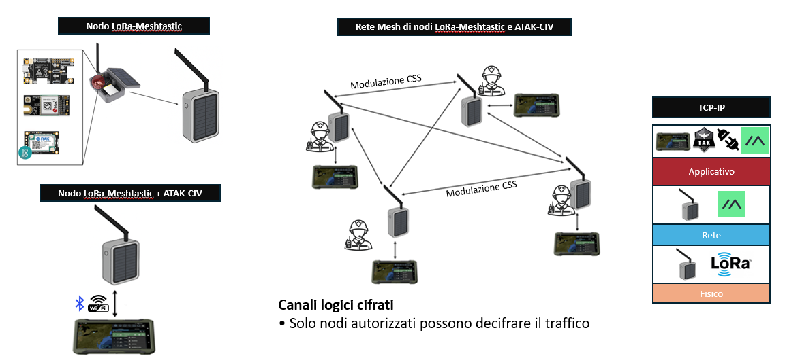

# Reti Mesh Decentralizzate LoRa per la Situational Awareness in Contesti Off-Grid

**Tesi di Laurea Magistrale in Sicurezza Informatica — Tecnologie e Sicurezza delle Reti di Comunicazione**  
**Francesco Paolo Di Lorenzo**  
Anno Accademico 2025/2026

## Panoramica

Questo repository raccoglie i materiali sviluppati per la mia tesi di Laurea Magistrale dedicata all'impiego di **reti mesh LoRa decentralizzate** per supportare la **Situational Awareness** e il mantenimento di una **Common Operational Picture (COP)** condivisa in scenari emergenziali e off-grid, nei quali le infrastrutture di comunicazione tradizionali possono risultare indisponibili, degradate o instabili.

Il lavoro analizza un'architettura integrata basata su **LoRa**, **Meshtastic** e **ATAK-CIV**, con particolare attenzione alla **resilienza delle comunicazioni**, alla sicurezza multilivello e al bilanciamento tra **livello di protezione, consumo energetico, overhead di rete e accuratezza delle informazioni**.

## Problema affrontato

In scenari emergenziali, operativi o off-grid, eventi naturali, guasti su larga scala, sabotaggi o condizioni degradate possono compromettere le comunicazioni convenzionali.

In tali condizioni, squadre di soccorso e operatori sul campo necessitano comunque di un canale dati minimo, resiliente e persistente per:

- scambiare informazioni essenziali;
- mantenere la Situational Awareness;
- aggiornare una Common Operational Picture condivisa;
- supportare il coordinamento operativo anche in assenza di connettività tradizionale.

## Obiettivi

Il lavoro persegue due obiettivi principali:

- supportare il mantenimento della **Situational Awareness** e della **Common Operational Picture** in scenari off-grid;
- definire un criterio di progettazione della sicurezza capace di bilanciare **sicurezza, consumo energetico, accuratezza informativa e vincoli normativi**.

I principali contributi sono:

- proposta di un'architettura integrata **LoRa + Meshtastic + ATAK-CIV**;
- analisi della postura di sicurezza e della superficie d'attacco ai livelli fisico, di rete e applicativo;
- definizione di un **modello di sicurezza basato su tre profili di rischio**;
- valutazione quantitativa dell'impatto delle contromisure sul carico di rete e sui vincoli di duty-cycle della banda EU868.

## Architettura del sistema

L'architettura integra:

- **LoRa**, tecnologia LPWAN a lungo raggio e basso consumo basata su modulazione Chirp Spread Spectrum;
- **Meshtastic**, firmware open-source che abilita una rete mesh LoRa decentralizzata e multi-hop;
- **ATAK-CIV**, piattaforma per la Situational Awareness e la costruzione di una Common Operational Picture condivisa;
- il **plugin ATAK per Meshtastic**, utilizzato come livello di integrazione tra il dispositivo mobile e la rete mesh LoRa.

## Analisi di sicurezza

La postura di sicurezza del sistema è analizzata su tre livelli:

| Livello | Principali aspetti di sicurezza |
|---|---|
| Fisico / Radio | Jamming, eavesdropping, esposizione del canale radio |
| Rete / Mesh | Spoofing, replay, tampering, nodi mesh malevoli, gestione delle chiavi |
| Applicativo | Injection, manipolazione dei dati operativi, autenticità e integrità end-to-end |

L'analisi evidenzia come la sicurezza complessiva dipenda dall'interazione tra livello radio, rete mesh, dispositivo e livello applicativo.

## Modello di sicurezza a profili di rischio

La tesi propone tre profili di sicurezza selezionabili in funzione del livello di minaccia operativo.

### Profilo Basso

Corrisponde alla configurazione standard delle componenti principali.

Caratteristiche:

- minimo overhead elaborativo e trasmissivo;
- massima autonomia energetica;
- maggiore frequenza di aggiornamento;
- maggiore esposizione alle vulnerabilità della configurazione standard.

### Profilo Medio

Introduce contromisure principalmente a livello firmware Meshtastic:

- **MAC** sui messaggi di canale;
- contatori **anti-replay**;
- randomizzazione temporale del traffico periodico;
- misure applicative di hardening e monitoraggio.

L'obiettivo è aumentare autenticazione, integrità e resistenza a replay e jamming reattivo mantenendo un overhead contenuto.

### Profilo Alto

Introduce misure più avanzate per scenari ad alta minaccia:

- **AEAD / AES-GCM** sui messaggi di canale;
- gestione gerarchica delle chiavi basata su root key di dominio;
- rotazione selettiva delle chiavi e revoca rapida dei nodi;
- **frequency hopping deterministico** basato su chiave di dominio;
- firma digitale dei messaggi **CoT**;
- validazione semantica dei dati;
- monitoraggio degli eventi di sicurezza;
- hardening applicativo.

Questo profilo privilegia confidenzialità, integrità, autenticità e resilienza rispetto ad attacchi persistenti o mirati.

## Valutazione quantitativa

L'impatto delle contromisure è stato valutato su uno scenario di riferimento composto da:

- **5 operatori** collegati tramite rete mesh LoRa;
- aggiornamenti GPS periodici ogni **120 secondi**;
- marker tattici sporadici ogni **90 minuti**;
- utilizzo della banda **EU868**;
- rispetto del vincolo di duty-cycle applicabile nella sottobanda 869,4–869,65 MHz.

I risultati principali sono:

| Profilo | Overhead di rete | Margine operativo residuo | Impiego |
|---|---:|---:|---|
| Medio | ≈ **+7,1%** | ≈ **16,4%** | Equilibrio tra sicurezza, consumo energetico e accuratezza della COP |
| Alto | ≈ **+18,2%** | ≈ **8,1%** | Scenari ad alta minaccia con requisiti di protezione più elevati |

Entrambi i profili risultano operativamente sostenibili entro i vincoli normativi considerati. La scelta del profilo dipende quindi soprattutto dal **livello di minaccia** e dal **valore informativo dei dati da proteggere**.

## Risultati principali

Il lavoro evidenzia che:

- una rete mesh **LoRa/Meshtastic** può costituire un canale di comunicazione autonomo e resiliente in assenza di connettività tradizionale;
- **ATAK-CIV** può utilizzare tale canale per mantenere una COP condivisa e supportare la Situational Awareness decentralizzata;
- le contromisure di sicurezza possono essere graduate in funzione del rischio operativo;
- l'aumento del livello di sicurezza introduce overhead misurabile, ma i profili analizzati restano compatibili con i vincoli EU868 considerati.

## Sviluppi futuri

La tesi individua come sviluppi futuri:

- realizzazione del sistema completo;
- studio approfondito del firmware Meshtastic;
- implementazione dei profili di rischio proposti;
- validazione sperimentale sul campo.

> **Nota sullo scope:** il repository documenta l'analisi architetturale, di sicurezza e quantitativa svolta nella tesi. La realizzazione completa del sistema e la validazione sperimentale sul campo sono indicate come sviluppi futuri.

## Contenuto del repository

- `tesi.pdf` — tesi completa
- `presentazione.pdf` — presentazione della tesi
- `README.md` — panoramica del progetto

## Parole chiave

`LoRa` · `Meshtastic` · `ATAK-CIV` · `Reti Mesh` · `Cyber Resilience` · `Situational Awareness` · `Common Operational Picture` · `Comunicazioni Off-Grid` · `LPWAN` · `EU868` · `Sicurezza Risk-Based`

---

**Autore:** Francesco Paolo Di Lorenzo
